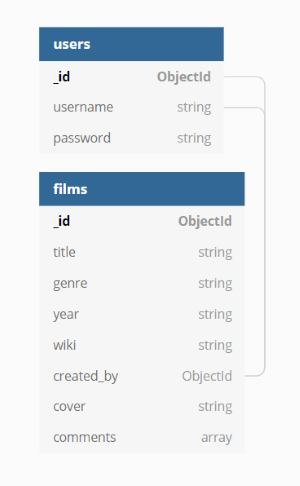

# Film's Archive Application


## Introduction
This is the source code of the "Film's Archive" Application. 

"Film's Archive" is the ideal app to allow many users to share their own film collection between each other.

Users can access the "My Films" page to see only their own film collection, or access the "All Films" page and have a view of the film collection of all the users registered on the app.

To see the app in action just click this [link](http://my-first-heroku-for-movies.herokuapp.com/).


## User Experience (UX)

-   ### User stories

    -   #### First Time Visitor Goals

        1. As a First Time Visitor, I want to easily understand the main purpose of the site.
        2. As a First Time Visitor, I want to be able to easily navigate throughout the application to find content.
        3. As a First Time Visitor, I want to easily be able to add new films to the collection.
        

    -   #### Returning Visitor Goals

        1. As a Returning Visitor, I want to have easy and fast access to the film's informations.
        2. As a Returning Visitor, I want to easily be able to filter one or more specific film title that I'm looking for.
        3. As a Returning Visitor, I want to easily be able to update or cancel an exsisting record.

    -   #### Frequent User Goals
    
        1. As a Frequent User, I want to check if there are any newly added function or content.
        2. As a Frequent User, I want to check if there are any new options to manipulate the record information.
        
        
-   ### Design
    -   #### Colour Scheme
        -   The two main colours used are blue, and light grey.
    
    -   #### Imagery
        -   Imagery is important. The background image with all the film covers is designed to be striking and catch the user's attention and let him understand what is the topic of the website. 


*   ### Wireframes

The wireframes information can be found [here](static/readMe_files/wireframes/wireframe.md).


## Features
### Existing Features
* #### Dynamic Search Bar 
    * Films can be searched or filtered by title using the search bar.
    * Users need to type at least one word contained in the film's title.
    * Number of results for searches is dynamically displayed on top of the page, just before the list of films.

* #### Cards Reveal
    * Each film is contained in a reveal card, that is a card with front and back side.
    * The front side shows a cover picture of the film followed by the title, the year and a link to direct the user to the wikipedia page of the film.
    * The title can occupy only one line. If it is longer it will be truncate. If the wikipedia link is not added a short paragraph will say "Link Not Added".
    * At the bottom of the card, if the film has been added by the user, the "edit" and "delete" buttons are displayed. If the film is added by another user, it will show the username of the user who added the film.
    * The back side of the card is accessable by clicking on the image on the front side.
    * The back side displays the full extended film's title and a comment section, where all the users can leave comment and feedback about the films.

* #### User Profile
    * User have to create a profile with username and password, in order to be able to access the application.

* #### Flash Messages 
    * Throughout the site, flash messages are used to give the user feedback, such as 
    when a user logs in, logs out, adds, edit or delete a film.

* #### Responsive Fixed Navbar
    * The Navbar is fixed and always attached to the top of the page.
    * When the screen size is less than 992px, a toggle menu appears on the top right corner of the screen.
    * When the toggle is clicked, a sideNav appears on the right side of the page and displays the links to access the other pages of the site. 
    * Logo text is always available on the top left corner. If clicked, redirects the user to the My Films page.
  
### Features Left to Implement
* #### Star Rating System
    * With more time, a nice 5 stars rating system will be added in the comment section.


* #### Recover Password
    * The register and login system used in this version is a lightweight and straightforward pyMongo method based on user-sessions. For a more sophisticated and robust user system authentication token system (i.e. JWT token) or the Flask-Login add-on have more secure options for the register, login, and password handling, including the option for recovering passwords with temporary session tokens which will be implemented in future versions.


* #### Custom 404 Page 
    * Fairly self explanatory, but this feature wasn't deemed necessary for the site to be deployed.
  
## Technologies Used

### Languages Used

This project makes use of:
* [HTML] - Base language for this project.
* [CSS] - Used for Styling the HTML code
* [JavaScript] - Used to make the web app interactive.
* [Python](https://www.python.org) - Used to build the functions of every html page
* [Mongo DB](https://www.mongodb.com) - Mongo DB is a document-oriented database program. Used to store all the films and users of the application.
* [Jinja Template](https://jinja.palletsprojects.com/) - Jinja is a web template engine for the Python programming language


### Libraries    
* [Materialize](https://materializecss.com/) - Used for responsive navbar, forms, buttons and cards.
* [JQuery](https://jquery.com/) - The project uses **JQuery** to simplify DOM manipulation.
* [FontAwseome](https://fontawesome.com/) - Used for all the icons in the application.


### API

* [Flask](https://flask.palletsprojects.com/en/1.1.x/) - Used to have more control and better interaction with the databases.


### TOOLS

* [Google Chrome] - Used for browser and dev tools
* [Mozilla Firefox] - Used for browser and dev tools
* [Microsoft Edge] - Used for browser and dev tools
* [Google] - **Google** was used for research.
* [Balsamiq Cloud](https://balsamiq.cloud/) - Used for creation of wireframes.
* [Gitpod](https://www.gitpod.io/) - Used as IDE for this project.
* [Git](https://git-scm.com/) - Used for Version Control
* [GitHub](https://github.com/) - Used to host repository and live website.
* [Heroku](https://www.heroku.com) - Heroku is a container-based cloud Platform. Used to deploy the application and create the domain.
* [Am I Responsive](http://ami.responsivedesign.is/) - Used for testing purposes as well as creating the image to display the web pages on different devices.
* [W3 Html validator](https://validator.w3.org/) - Used to test and validate my html code.
* [W3 Css validator](https://jigsaw.w3.org/) - Used to test and validate my css code.
* [JSHint](https://jshint.com/) - Used to validate my Javascript code.
* [Color Scheme Designer](http://colorschemedesigner.com/) - Used to test colour combinations.
* [Free Formatter](https://www.freeformatter.com/) - Used to format my html, css and javascript code.
* [Python Formatter](https://codebeautify.org/python-formatter-beautifier) - Used to format my python files
* [PageSpeed insights](https://developers.google.com/speed/pagespeed/insights/) - Used for testing the loading speed of the site.


###### A caption of a speed test on PageSpeed insights.


## Testing

Testing information can be found [here](static/readMe_files/testing/testing.md).


## Code Validation
* I used the [W3 Html validator](https://validator.w3.org/) service to validate my Html code.

* I used the [W3 Css validator](https://jigsaw.w3.org/) service to validate my Css code.

* I used the [JSHint](https://jshint.com/) service to validate my JavaScript code.


### Known Bugs

-   The console is displaying an Error 404 (favicon.ico:1) but after a deep research I can't understand what the error is about. However, this error is not interfering with the functionality of the code.
-   When the comments are added, the css properties are not loaded until the page is not refreshed.


## Deployment

This project was developed using Gitpod as the chosen IDE and GitHub as a remote repository. The Project's source files were regularly pushed to the [GitHub repository](https://github.com/OmarBedawi/myMovies) via the `master` branch.

**Local Deployment**: To reproduce this project within a local deployement, use the following steps and requirements:

1. Have the following installed in your IDE of choice:

- Git (for version control)

- pip (package installer for Python; pip3 was used at the time of production: May 2021)

- Python3 (the programming language used to produce the backend logic of this project) using the following command:
    
    - `pip3 install dnspython`

- Flask (the library used to add special features and functionalities to this Python application) using the following command:
    
    - `pip3 install flask`

2. Create an account with [MongoDB](https://www.mongodb.com/), following the MongoDB instructions for the creation of a Cluster 

- Create two Collections named 'users' and 'films' and enter key/values as follows:  

    - **users** collection

        ```json
                _id: <ObjectId>
                username: "<string>"
                password: "<string>"

        ```

    - **films** collection

        ```json
                _id: <ObjectId>
                title: "<string>"
                genre: "<string>"
                year: "<string>"
                wiki: "<string>"
                created_by: "<ObjectId>"
                cover: "<string>"
                comments: "<array>"
        ```

ERD - Entity Relational Diagram




3. Connect your database server with your Flask application:
    
    - From your MongoDB cluster dashboard >> click on CONNECT  >> choose "Connect your application" >> Driver: Python and Version: your python version.
    
    - Register your MONGO_URI credentials inside your env.py file withing your project, by using the follwoing commands:

        - `touch .gitignore`
        - `touch env.py`

    - Connect your MongoDB data to your Flask app using the following command:

        - `pip3 install flask-pymongo`

    - Add the environment variables to your env.py file:

        `import os`

        `os.environ.setdefault("MONGO_URI", "your_mongodb_credential_data")`
        <br>
        `os.environ.setdefault("MONGO_DBNAME", "your_mongodb_name")`
        <br>
        `os.environ.setdefault("IP", "0.0.0.0")`
        <br>
        `os.environ.setdefault("PORT", "5000")`
        <br>
        `os.environ.setdefault("SECRET_KEY", "your_secret_key")`

4. Install additional packages:
        
    - `pip3 install flask-paginate`
    
5. Update the requirements.txt file using the following command:

    - `pip3 freeze > requirements.txt`

6. These files were added, commited and pushed to github using the commands `git add`  `git commit`  `git push` .

**Heroku Deployment**: The Project's source file was also pushed to [Heroku](https://heroku.com/) via the `heroku master` branch. To deploy this app to a Heroku app use the following steps:

1. A `requirements.txt` file was created using the terminal command `pip3 freeze > requirements.txt`.

2. A `Procfile` was created using the terminal command `echo web: python app.py > Procfile`.

3. A new app was created for the myMovies on Heroku dashboard, by clicking the "New" button and setting the region to Europe. It is necessary to open an account with Heroku and start a new app installation inside your heroku dashboard. 

4. New app configurations including environament variables were added on "Settings" > "Reveal Config Vars" inside the Heroku dashboard:
    - IP: 0.0.0.0
    - PORT: 5000
    - SECRET_KEY: your_secret_key
    - MONGO_URI: your_mongodb_credential_data
    - MONGO_DBNAME: your_mongodb_name

5. From the Heroku dashboard the app was deployed using the "Deploy button" and connected to the gihub master branch for automatic deployments.

6. These files were added, commited and pushed to github using the commands `git add`  `git commit`  `git push` .

7. The web app is now successfully deployed.


### Forking the GitHub Repository

By forking the GitHub Repository we make a copy of the original repository on our GitHub account to view and/or make changes without affecting the original repository by using the following steps...

1. Log in to GitHub and choose [myMovies](https://github.com/OmarBedawi/myMovies).
2. At the top of the Repository just above the "Settings" Button on the menu, locate and click the "Fork" Button.
3. You should now have a copy of the original repository in your GitHub account.


## Credits
### Code

-   Cards, Navbar, Buttons and Form elements adjusted from Materialize library.
-   README structure borrows heavily from the [Code institute readme example](https://github.com/Code-Institute-Solutions/SampleREADME#)

### Content
-   [Task Manager](https://github.com/Code-Institute-Solutions/TaskManager) is a Code Institute mini project. It was a very helpful tool in setting up the site.

### Media

-   All the film images and the background image are coming from google research.

### Acknowledgements

-   My Mentor Antonio Rodriguez for continuous helpful feedback.

-   Tutor support at Code Institute for their support.

